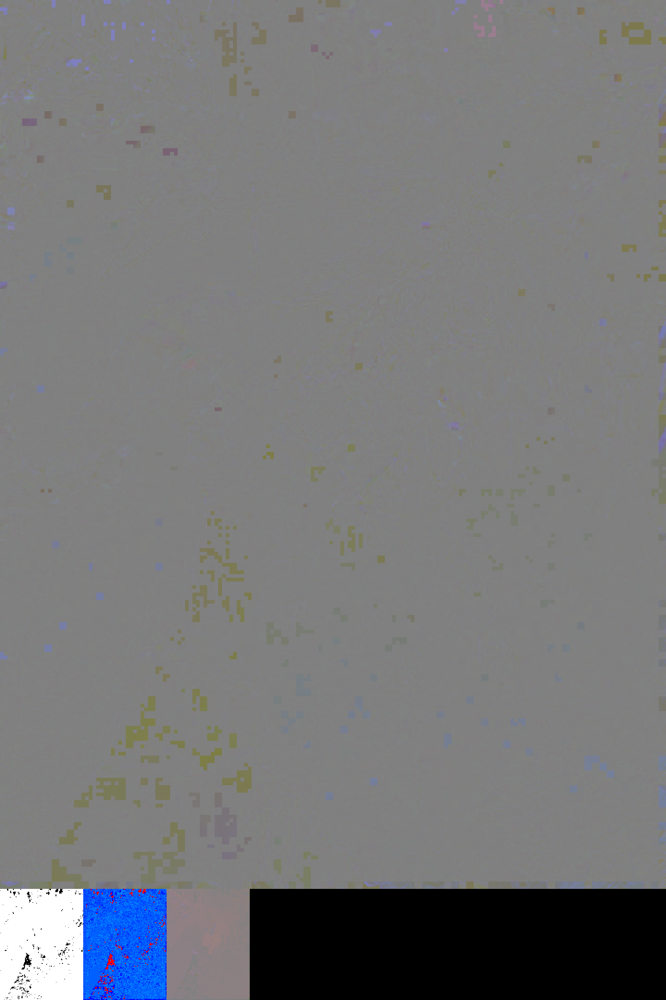

### rdm-png-v2

Width: `(width+15)&~0xF`  
Height: `(height+15)&~0xF + (((height+15)&~0xF)>>3)`

#### Residual

X: `0`  
Y: `0`  
Width: `(width+15)&~0xF`  
Height: `(height+15)&~0xF`  

YCbCr: `4:4:4`

#### Display Fragments

X: `((width+15)&~0xF)>>3`   
Y: `(height+15)&~0xF`  
Width: `((width+15)&~0xF)>>3`  
Height: `((height+15)&~0xF)>>3`

value: `0` or `0xFFFFFF`

#### Coding Mode

X: `0`  
Y: `(height +15)&~0xF`  
Width: `((width+15)&~0xF)>>3`  
Height: `((height+15)&~0xF)>>3`  

value:

##### Intra 
`rgb(1,1,255)`

##### Inter
`(255,0,0)`

##### Inter + MV
`rgb(255,96,2)`  
`rgb(255,128,4)`  
`rgb(255,160,16)`  
`rgb(255,196,128)`  

##### Golden
`rgb(32,255,32)`  

##### Golden + MV
`rgb(196,255,64)`  

#### Motion Vector

X: `(((width+15)&~0xF)>>3)<<1`   
Y: `(height+15)&~0xF`  
Width: `((width+15)&~0xF)>>3`  
Height: `((height+15)&~0xF)>>3`

value: `((unsigned char)((y+0x80)&0xFF))<<16|0x8000|((unsigned char)((x+0x80)&0xFF))`

See also  
[rdm03.js](https://mizt.github.io/blog/?id=rdm03)